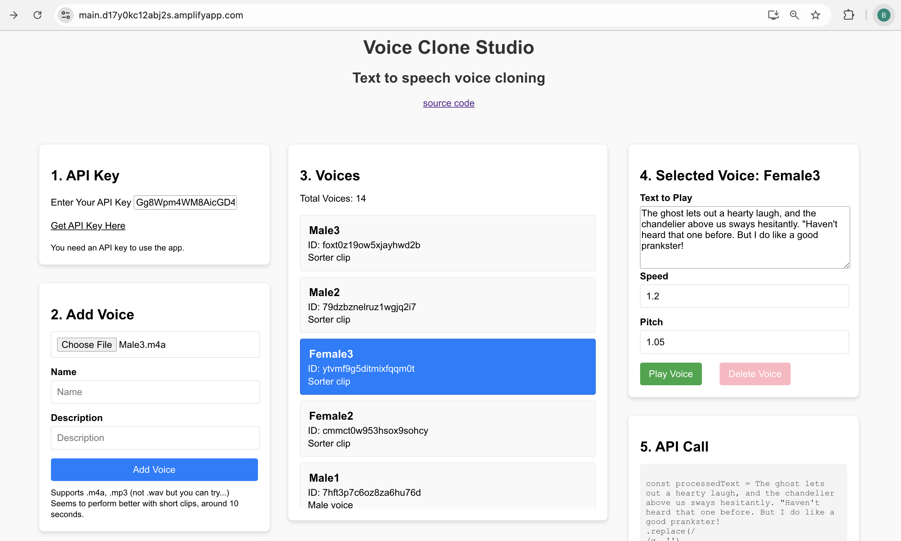

# Infra TTP Dashboard

A custom dashboard designed to enhance the user experience of working with Infra's TTP AI model. This tool provides a more intuitive and efficient way to interact with the TTP AI model, overcoming the limitations of Infra's demo app.

## Demo Link
You can try the app here:
[Coming Soon]()

Explore the original Infra TTP AI model here:
[Infra TTP AI Model Demo](https://deepinfra.com/deepinfra/tts?version=6c2b0d75eae4b7047358e3b6bd9325f857d43f77)

## App Screenshot



## Features

- **Improved Interface**: A user-friendly and intuitive design for working with the TTP AI model.
- **Custom Enhancements**: Added features and workflows to address limitations in the demo app.
- **Seamless Integration**: Easily interact with the Infra TTP AI model.
- **Enhanced Performance**: Optimized for faster and smoother operations.

## Why This Dashboard?

Infra's official demo app for the TTP AI model is functional but lacks usability features. This dashboard was built to:

- Provide a better user experience.
- Enable more customization and flexibility.
- Simplify interaction with the TTP AI model.

## How to Use

1. Clone this repository:
   ```bash
   git clone https://github.com/your-repo-name/infra-ttp-dashboard.git
   ```

2. Install dependencies:
   ```bash
   npm install
   ```

3. Start the development server:
   ```bash
   npm start
   ```

4. Open your browser and navigate to:
   ```
   http://localhost:3000
   ```

5. Add your Infra API key to get started.

## Requirements

- Node.js >= 14.0
- Infra API key (get yours from [Infra](https://deepinfra.com/dash/api_keys))

## Tech Stack

- **Frontend**: React, React Query
- **Styling**: CSS
- **API Integration**: Axios

## Roadmap

- [ ] Add user authentication.
- [ ] Implement usage analytics.
- [ ] Support additional AI models from Infra.

## Contributing

Contributions are welcome! If you have suggestions or find issues, feel free to submit a pull request or open an issue.

1. Fork the repository.
2. Create a new branch:
   ```bash
   git checkout -b feature-name
   ```
3. Commit your changes:
   ```bash
   git commit -m "Added new feature"
   ```
4. Push to your branch:
   ```bash
   git push origin feature-name
   ```
5. Open a pull request.

## License

This project is licensed under the [MIT License](LICENSE).

## Acknowledgements

- [Infra TTP AI Model](https://deepinfra.com/deepinfra/tts?version=6c2b0d75eae4b7047358e3b6bd9325f857d43f77)
- [React](https://reactjs.org/)
- [React Query](https://react-query.tanstack.com/)
